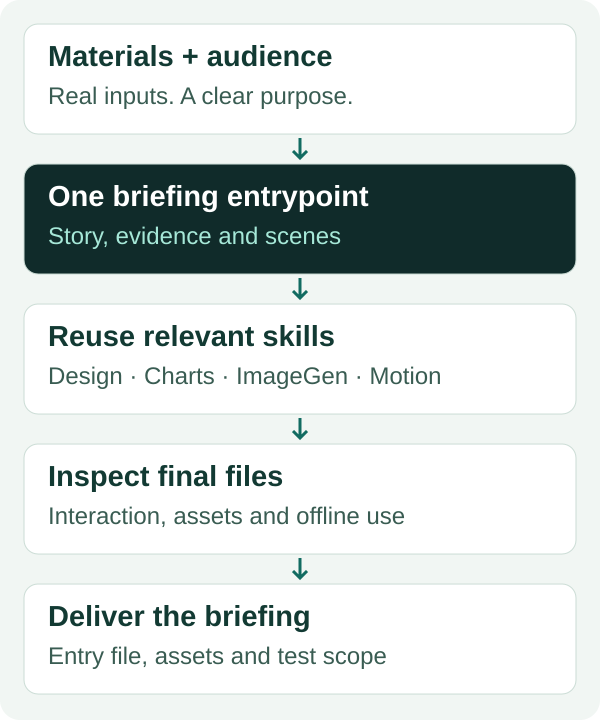

# HTML Brifing

<p align="center">
  <a href="README.md"></a>
  <a href="README.zh-CN.md"></a>
</p>


Turn project materials into an evidence-led HTML briefing by coordinating the design, chart, image, writing and browser skills you already use. For technical teams, researchers and practitioners explaining how their work operates and what its results support.

**One entrypoint. Keep your existing skills. Deliver an explanation people can inspect.**

[Install](#1-install) · [Try a request](#2-use-it) · [Download v0.1.0](https://github.com/thejaytang/html-brifing/releases/tag/v0.1.0) · [Capability map](plugins/html-brifing/skills/html-brifing/references/capabilities.md)

The identifier `html-brifing` is intentional. This is a skill orchestration plugin, not a slide editor or an automatic dependency manager.

## 1. Install

Requires a Codex host with plugin support, file access and an authorized project workspace. A browser is needed to verify the rendered deliverable. Optional helpers and their tools are detected by the agent when relevant; none are bundled or installed automatically.

```sh
codex plugin marketplace add thejaytang/html-brifing --ref v0.1.0
codex plugin add html-brifing@html-brifing
```

Start a **new chat**, select **HTML Brifing** if needed, and invoke `$html-brifing`. Do not remove or overwrite existing design, ImageGen, writing or chart skills. Choose one briefing entrypoint per task if an older personal briefing skill also exists.

For a downloaded release, extract the archive, enter its `html-brifing-0.1.0` directory, then run:

```sh
codex plugin marketplace add .
codex plugin add html-brifing@html-brifing
```

Use either installation route, not both. See [maintenance](docs/maintenance.md) for updates and source changes. The archive includes the marketplace; installing only the nested plugin directory is not the documented route.

## 2. Use it

Illustrative requests, not claims about measured business outcomes:

| Situation and input | Request | Expected output and success |
|---|---|---|
| A technical project with source notes and test records | “Use $html-brifing to make a 10-minute offline HTML briefing for colleagues unfamiliar with this project.” | Context, design, mechanism and observed results; final files opened and checked offline |
| An existing briefing with confusing interactions | “Use $html-brifing to fix the nested explanations in this HTML. Keep the narrative and visual direction.” | Scoped repair; selecting, switching and collapsing affected objects leaves no stale details |
| A concept needs a visual explanation | “Use $html-brifing to explain this mechanism with an ImageGen illustration and editable labels.” | Inspected conceptual image, precise page labels and packaged assets; missing generation tools are disclosed |
| A decision is still being discussed | “Use $html-brifing to review these materials and propose an outline only.” | An evidence-bound outline; no implementation, installation or publication |

Open [the fictional offline example](examples/offline-routing.html) directly in a browser. It demonstrates object-bound explanations; it does not connect to a real scheduler.

## 3. How the combination works



The lead skill establishes the audience, argument and evidence. It chooses the relevant available helpers, keeps their outputs consistent, and verifies the final briefing. The illustration describes the intended workflow; it is not an automatic execution engine.

| Capability | Preferred existing helper | What it contributes |
|---|---|---|
| Visual system | Impeccable; targeted UI UX Pro Max references | Consistent hierarchy, layout, typography and states |
| Data and tables | academic-research-plotting, research-results-tables or equivalents | Defined metrics, faithful charts and reconciled tables |
| Raster visual expression | ImageGen | Scenes, objects, illustrations, image edits and cutouts |
| Precise relationships | Native HTML/SVG and the bundled diagram guidance | Editable labels, architecture, field mapping and interactions |
| Meaningful motion | Relevant GSAP skills | Object continuity and coordinated state changes |
| Writing | Humanizer or academic-humanizer | Natural wording with evidence preserved |
| Code implementation | Project rules; Ponytail when available | Simple complete implementation without sacrificing checks |
| Verification | Host browser tools or Playwright | Actual rendering, interactions and delivery checks |
| Chat exploration | Visualize when available | Conversation preview, separate from the offline artifact |

Missing optional helpers use documented baselines. An unavailable required browser or image-generation tool remains an explicit gap. A skill file alone does not provide a model, runtime, credentials or service access. No silent paid ImageGen API fallback.

## 4. Experience built into the workflow

- Give unfamiliar audiences the business context before implementation detail.
- Keep the core solution visible; attach secondary explanations to their objects.
- Make controls change evidence, operations or output, not just decoration.
- Preserve identity across scenes; correctly clear nested disclosure and selection.
- Show how a test was done beside what it observed and what that supports.
- Check the moved/extracted final package; a development server or a Mac screenshot does not prove offline Windows acceptance.

[Distilled experience](plugins/html-brifing/skills/html-brifing/references/experience.md) separates these transferable lessons from optional title styles, navigation and motion preferences. No private business data or project screenshots are included.

## 5. Fit, compatibility and limits

Use this for project briefings, research explanations, technical demos and presenter-controlled HTML reports. Choose a production-web workflow for applications, a native presentation workflow for editable PPTX, or ordinary writing for a text-only update.

| Surface | Scope |
|---|---|
| Codex on macOS | Release target; actual installation and package evidence is recorded in the validation report |
| Windows / Linux | Portable text/resources, but native installation and rendered acceptance are not verified |
| Other skill hosts | No compatibility claim; host tooling and plugin format require adaptation/testing |
| ImageGen, GSAP and other helpers | Optional external capabilities; not all combinations are exercised in this release |
| Offline output | A production requirement for new standalone local briefings, verified per artifact; plugin installation itself may need network access |

The workflow is interpreted by the agent. It does not guarantee deterministic routing or universally correct output. Instructions are primarily English; the detailed delivery checklist is retained in Chinese. Both README languages describe the same capabilities; this does not establish bilingual runtime testing.

## 6. Development, evidence and sources

```sh
python3 scripts/check_package.py
python3 -m unittest discover -s tests
```

The checker uses Python 3.10+ standard library only. It validates package paths and resources, not browser behavior. Read [AGENTS.md](AGENTS.md), [current state](PROJECT_STATE.md) and [release validation](project-support/evaluation.md) before contributing. Reproduction reports should identify the scene, state, viewport and input without private material.

[Sources and optional upstreams](plugins/html-brifing/skills/html-brifing/references/sources.md) distinguish inspiration, recommended helpers and host documentation. Third-party skills are not copied into this repository.

[MIT](LICENSE), copyright 2026 Jay Tang, covers this repository's original guidance, artwork and checker. External skills, libraries and services keep their own terms. [Issues and suggestions](https://github.com/thejaytang/html-brifing/issues) are welcome.
