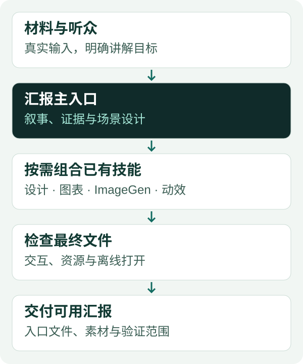

# HTML Brifing

<p align="center">
  <a href="README.md"></a>
  <a href="README.zh-CN.md"></a>
</p>


通过内置的 19 个设计、图表、图像、动效、文字和浏览器验收技能，把项目材料做成有证据支撑的 HTML 汇报。适合需要解释工作机制与结果的技术团队、研究者和业务实践者。

**一个入口，保留已有技能，交付可查看、可操作的解释。**

[安装](#1-安装) · [试用请求](#3-使用) · [下载 v0.3.0](https://github.com/thejaytang/html-brifing/releases/tag/v0.3.0) · [能力映射](plugins/html-brifing/skills/html-brifing/references/capabilities.md)

包内提供可移植的根级 `plugin.json`，并保留受支持的 Codex 兼容清单；这不等于已经验证跨宿主运行。标识符有意保留为 `html-brifing`。这是技能编排插件，不是幻灯片编辑器或自动依赖管理器。

## 1. 安装

需要支持插件的 Codex、文件访问能力和已授权的项目工作区。实际渲染验收需要浏览器。插件一次安装全部 19 个可再分发的工作流技能。宿主服务和运行库仍需单独具备，首次设置会检查是否可用。

```sh
codex plugin marketplace add thejaytang/html-brifing --ref v0.3.0
codex plugin add html-brifing@html-brifing
```

安装后开启**新聊天**，必要时选择 **HTML Brifing**，先运行一次 `$html-brifing-setup`：检查包是否完整，以及运行条件是否具备，区分可用、缺失和未知。已内置的技能无需另行下载。随后用 `$html-brifing` 制作汇报。主技能也会引导首次使用者完成检查；安装插件本身不会自动执行设置钩子。已有设计、ImageGen、写作与图表技能无需删除或覆盖。如果保留了旧的个人汇报技能，每个任务选择一个汇报主入口。

使用发布压缩包时，解压并进入 `html-brifing-0.3.0` 目录，然后运行：

```sh
codex plugin marketplace add .
codex plugin add html-brifing@html-brifing
```

两条安装路径选择一条即可。更新和切换来源见[维护说明](docs/maintenance.md)。压缩包包含插件市场入口；不要只取内层插件目录来执行上述安装流程。

## 2. 插件实际包含什么

**插件内置 19 个真实技能入口**，所需参考资料、脚本、数据、预设和许可一同打包。已有个人技能保留：明确指定已有版本时优先使用，否则主流程使用包内版本。

| 内置工作流 | 入口数 | 来源与职责 |
|---|---:|---|
| HTML Brifing 与首次设置 | 2 | Jay Tang：叙事、证据、图解、组合统筹与交付验收 |
| Impeccable | 1 | [pbakaus](https://github.com/pbakaus/impeccable)：主视觉系统与视觉审查 |
| UI UX Pro Max | 1 | [nextlevelbuilder](https://github.com/nextlevelbuilder/ui-ux-pro-max-skill)：可搜索的设计与图表参考 |
| Humanizer | 1 | [blader](https://github.com/blader/humanizer)：普通文字自然表达 |
| ImageGen | 1 | [OpenAI](https://github.com/openai/skills/blob/main/skills/.system/imagegen/SKILL.md)：图像生成、编辑规则与备用脚本 |
| Playwright | 1 | [OpenAI](https://github.com/openai/skills/blob/main/skills/.curated/playwright/SKILL.md)：浏览器验收规则与命令包装脚本 |
| Ponytail | 1 | [DietrichGebert](https://github.com/DietrichGebert/ponytail)：简洁完整的代码实现；包含核心技能，不包含其独立插件的 hooks/MCP 或可选 audit/gain 命令 |
| GSAP Skills | 8 | [GreenSock](https://github.com/greensock/gsap-skills)：core、timeline、scrolltrigger、plugins、utils、react、performance、frameworks |
| Academic Humanizer | 1 | [作者维护的上游](https://github.com/thejaytang/academic-humanizer)：保留证据边界的学术表达，原上游署名保留 |
| Academic Research Plotting | 1 | [作者维护的上游](https://github.com/thejaytang/academic-research-plotting)：选图、样式、检查与导出 |
| Research Results Tables | 1 | [内置技能](plugins/html-brifing/skills/research-results-tables/SKILL.md)：数值核对与结果表 |

[全部 19 个入口](plugins/html-brifing/skills/html-brifing/references/bundled-skills.md) · [许可、来源和打包修改记录](plugins/html-brifing/THIRD_PARTY_NOTICES.md)

**Visualize 是唯一保留在外部的技能集成**。本机 OpenAI 插件清单明确标注 `Proprietary`，未取得再分发授权，因此没有复制其原文件。宿主已提供时可用于对话预览；独立 HTML/SVG 解释不依赖它。来源说明中的早期工作流借鉴属于出处记录，不是实际依赖的技能。

首次使用现在建议补齐的是**运行能力**：图像生成工具、可用浏览器（或执行 Playwright 包装脚本的 Node/npx）、绘图所需 Python/Matplotlib，以及需要动效时的 GSAP JavaScript 库。Impeccable 的启动器与参考资料已内置，其单独的平台引擎可由上游启动器在使用时下载。设置检查本身不安装依赖、不启用 hooks，也不切换付费 API。

## 3. 使用

下列为示例请求，不代表已测量的业务效果：

| 场景与输入 | 请求 | 预期交付及成功条件 |
|---|---|---|
| 有项目说明与测试记录的技术项目 | “使用 $html-brifing，为不熟悉项目的同事制作 10 分钟离线 HTML 汇报。” | 上下文、设计、机制与实测结果完整；最终文件经过离线打开验收 |
| 交互混乱的已有汇报 | “使用 $html-brifing，修复这份 HTML 的嵌套说明，保留叙事和视觉方向。” | 局部修复；受影响对象的选择、切换和折叠没有残留说明 |
| 需要形象解释的概念 | “使用 $html-brifing，用 ImageGen 插画与可编辑标签解释这个机制。” | 检查后的概念图、精确标签和完整素材包；生成工具缺失时说明缺口 |
| 仍处在讨论阶段 | “使用 $html-brifing，审阅材料并只给提纲。” | 基于证据的提纲；不实施、不安装、不发布 |

可直接用浏览器打开[虚构离线示例](examples/offline-routing.html)，查看绑定到对象的展开说明。它不连接真实排程系统。

## 4. 如何组合



主技能确定听众、论证和证据，选择当前可用的相关辅助技能，统一它们的输出，并验收最终汇报。图示说明工作流程，不代表自动执行引擎。

| 能力 | 内置技能或宿主能力 | 提供什么 |
|---|---|---|
| 视觉系统 | Impeccable，按需参考 UI UX Pro Max | 统一层级、布局、字体与状态 |
| 数据图表与表格 | academic-research-plotting、research-results-tables 或等价技能 | 明确指标、忠实图表与核对后的结果表 |
| 位图视觉表达 | ImageGen | 场景、对象、插画、图片编辑和透明素材 |
| 精确关系表达 | 原生 HTML/SVG 与内置图解规则 | 可编辑标签、架构、字段映射和交互 |
| 有解释作用的动效 | 所需的 GSAP 技能 | 对象连续性与联动状态 |
| 文字 | Humanizer 或 academic-humanizer | 保持事实含义的自然表达 |
| 代码实现 | 项目规则；可用时使用 Ponytail | 不牺牲验收的简洁完整实现 |
| 验收 | 宿主浏览器工具或 Playwright | 实际渲染、操作与交付检查 |
| 聊天内探索 | 可用时使用 Visualize | 对话内预览，与离线交付物分开 |

辅助技能缺失时采用已写明的基础路径。必要的浏览器或图像生成工具缺失时保留明确缺口。技能文件本身不提供模型、运行环境、凭据或服务权限；不得静默切换到付费 ImageGen API。

## 5. 沉淀的实践经验

- 先让陌生听众理解业务上下文，再进入实现细节。
- 主视图保留方案核心，次要说明绑定到具体对象。
- 控件改变证据、操作或输出，不能只改变装饰。
- 跨场景保持对象身份，正确清理嵌套展开和选中状态。
- 把测试方法、观察结果与可支持的结论放在一起。
- 验收移动或解压后的最终包；开发服务器运行或 Mac 截图不能证明 Windows 离线验收。

[经验沉淀说明](plugins/html-brifing/skills/html-brifing/references/experience.md)区分通用经验与可覆盖的标题、导航、动效偏好。仓库不包含私有业务数据或项目截图。

## 6. 适用范围、兼容性与限制

适用于项目汇报、研究解释、技术演示和讲者控制的 HTML 报告。生产应用使用网站开发流程，可编辑 PPTX 使用原生演示流程，纯文字周报使用普通写作流程。

| 环境 | 范围 |
|---|---|
| macOS 上的 Codex | 本次发布目标；实际安装与包验证证据见验证记录 |
| Windows / Linux | 文件和资源可迁移，但尚未验证原生安装和渲染验收 |
| 其他技能宿主 | 不声明兼容；需适配并验证宿主工具和插件格式 |
| ImageGen、GSAP 等辅助能力 | 技能文件已内置；运行环境和服务权限单独检查，本次未逐一运行所有组合 |
| 离线输出 | 新建独立本地汇报的制作要求，逐份验收；插件安装本身可能联网 |

Agent 根据规则执行工作流，插件不保证确定性的技能调度或所有输出都正确。技能说明以英文为主，详细交付清单保留中文。两份 README 描述相同能力，不等于已验证双语运行表现。

## 7. 开发、证据与来源

```sh
python3 scripts/check_package.py
python3 -m venv .venv
.venv/bin/python -m pip install -r requirements-dev.lock
.venv/bin/python -m unittest discover -s tests
```

检查工具只需要 Python 3.10+ 标准库。完整测试还会运行内置绘图脚本；锁文件记录本次 Python 3.12 macOS 测试环境。其他系统需使用对应的虚拟环境执行路径，原生验收尚未验证。结构检查不代替浏览器验收。贡献前阅读 [AGENTS.md](AGENTS.md)、[当前状态](PROJECT_STATE.md)和[发布验证记录](project-support/evaluation-0.3.0.md)。复现报告请说明场景、状态、窗口和输入，不附私有材料。

[来源与可选上游](plugins/html-brifing/skills/html-brifing/references/sources.md)区分借鉴来源、推荐技能和宿主文档。再分发的技能保留上游许可与署名；仅 Visualize 保持外部专有集成。

[MIT 许可](LICENSE)，版权所有 2026 Jay Tang，覆盖本仓库原创规则、图形和检查工具。内置技能分别保留 MIT 或 Apache-2.0，详见[第三方许可说明](plugins/html-brifing/THIRD_PARTY_NOTICES.md)；运行库和服务保留各自条款。欢迎通过 [Issues](https://github.com/thejaytang/html-brifing/issues) 反馈。
